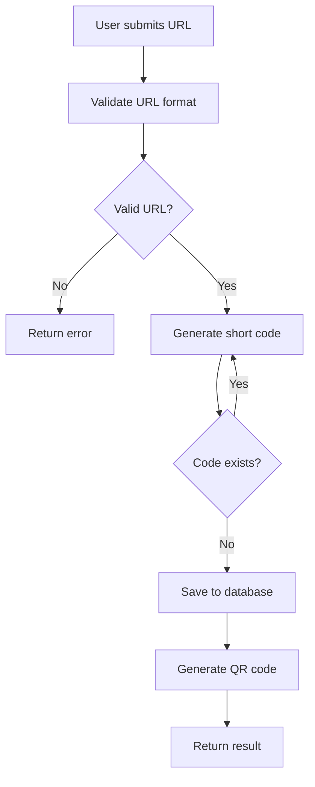
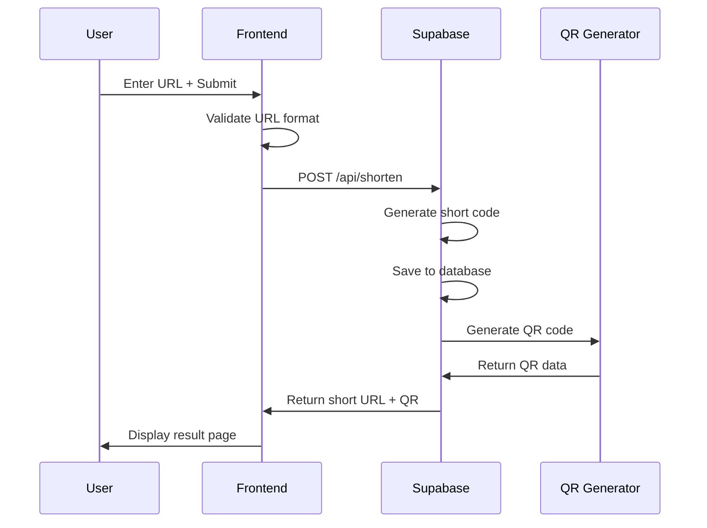
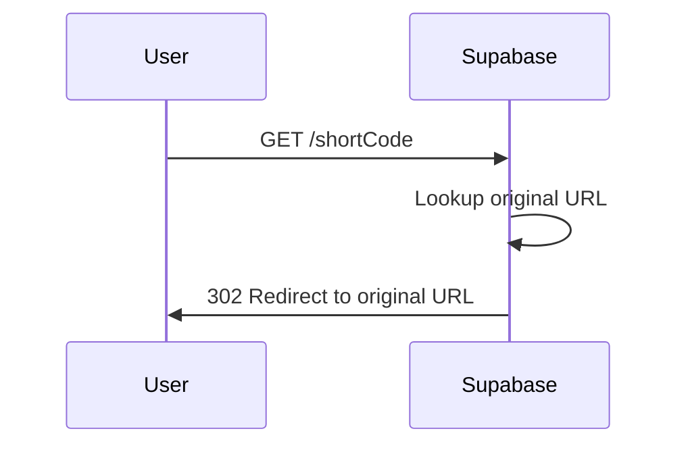

# bitl.pro - Link Shortener Service Design

## Overview

bitl.pro is a minimalist, fast link shortener service that allows users to convert long URLs into short, shareable links with accompanying QR codes. The service emphasizes simplicity and speed with a clean monochrome design.

### Core Requirements

- **VERY SIMPLE and FAST** user experience
- Minimalist monochrome design using Inter font with XL typography
- Full mobile responsive design
- QR code generation for each shortened link
- Frontend deployment on Netlify
- Backend powered by Supabase

### Out of Scope (Current Version)

- Admin panel
- Analytics/statistics
- Complex business logic
- User authentication
- Custom domains

## Technology Stack

### Frontend

- **Framework**: React/Next.js or Vanilla HTML/CSS/JS
- **Styling**: CSS with monochrome palette
- **Typography**: Inter font, XL sizing
- **Deployment**: Netlify
- **QR Generation**: qrcode.js or similar library

### Backend

- **Database**: Supabase (PostgreSQL)
- **API**: Supabase REST API
- **Hosting**: Supabase cloud

## Frontend Architecture

### Component Hierarchy

```
App
├── HomePage
│   ├── Header (Logo)
│   ├── LinkForm (Input + Button)
│   └── Footer (Copyright)
└── ShortLinkPage
    ├── Header (Logo)
    ├── ResultDisplay
    │   ├── ShortLink (Large display)
    │   ├── CopyButton
    │   └── QRCode
    └── Footer (Copyright)
```

### Page Structure

#### Home Page (`/`)

- **Header**: bitl.pro logo
- **Main Content**:
  - Large text input for URL
  - Submit button/Enter key functionality
- **Footer**: Copyright notice

#### Short Link Result Page (`/[shortCode]` or `/result`)

- **Header**: bitl.pro logo
- **Main Content**:
  - Generated short link (displayed prominently)
  - Copy to clipboard button
  - QR code visualization
- **Footer**: Copyright notice

### State Management

- Simple component state for form handling
- URL validation state
- Copy success feedback state
- Loading states during API calls

### Styling Strategy

#### Color Palette (Monochrome)

- **Primary**: #000000 (Black)
- **Secondary**: #FFFFFF (White)
- **Accent**: #666666 (Gray)
- **Background**: #FAFAFA (Light Gray)

#### Typography

- **Font Family**: Inter
- **Sizes**:
  - Logo: 2xl-3xl
  - Short Link Display: 4xl-5xl
  - Input: xl
  - Body: lg
  - Footer: sm

#### Mobile Responsiveness

- Mobile-first approach
- Breakpoints: 640px, 768px, 1024px
- Touch-friendly button sizes (44px minimum)
- Optimized typography scaling

## Backend Architecture

### Database Schema

```sql
-- URLs table
CREATE TABLE urls (
  id SERIAL PRIMARY KEY,
  original_url TEXT NOT NULL,
  short_code VARCHAR(10) UNIQUE NOT NULL,
  created_at TIMESTAMP DEFAULT NOW(),
  expires_at TIMESTAMP DEFAULT (NOW() + INTERVAL '1 year')
);

-- Index for fast lookups
CREATE INDEX idx_short_code ON urls(short_code);
CREATE INDEX idx_created_at ON urls(created_at);
```

### API Endpoints

#### POST /api/shorten

**Purpose**: Create a new short link

**Request Schema**:

```json
{
  "url": "https://example.com/very/long/url"
}
```

**Response Schema**:

```json
{
  "success": true,
  "data": {
    "shortCode": "abc123",
    "shortUrl": "https://bitl.pro/abc123",
    "originalUrl": "https://example.com/very/long/url",
    "qrCode": "data:image/png;base64,..."
  }
}
```

#### GET /[shortCode]

**Purpose**: Redirect to original URL

**Response**:

- 302 redirect to original URL
- 404 if short code not found
- 410 if link expired

### Short Code Generation Algorithm

```
Algorithm: Base62 Encoding
- Characters: [a-zA-Z0-9] (62 characters)
- Length: 6 characters
- Total combinations: 62^6 = ~56 billion URLs
- Collision handling: Regenerate if exists
```

### Business Logic Layer

#### URL Validation

```
Input Validation:
1. Check if URL is provided
2. Validate URL format (starts with http/https)
3. Check URL accessibility (optional ping)
4. Sanitize input
5. Check against blacklist (malicious domains)
```

#### Link Generation Process



#### QR Code Generation

- **Library**: qrcode.js (frontend) or qrcode (backend)
- **Format**: PNG, base64 encoded
- **Size**: 200x200 pixels
- **Error Correction**: Medium level

## Data Flow Between Layers

### Link Creation Flow



### Link Redirect Flow



## User Experience Flow

### Primary User Journey

1. **Landing**: User visits bitl.pro
2. **Input**: User pastes long URL into input field
3. **Submit**: User presses Enter or clicks submit button
4. **Processing**: Short loading state (< 1 second)
5. **Result**: User sees short link prominently displayed with QR code
6. **Copy**: User copies short link with one click
7. **Share**: User shares short link or QR code

### Error Handling

- **Invalid URL**: Inline validation message
- **Network Error**: Retry option with user-friendly message
- **Server Error**: Generic error message with refresh option
- **Not Found (404)**: Custom page for invalid short codes

## Mobile Responsiveness Strategy

### Mobile Layout (< 768px)

- Single column layout
- Full-width input field
- Large touch targets (minimum 44px)
- Optimized font sizes
- QR code sized for mobile viewing

### Tablet Layout (768px - 1024px)

- Centered content with max-width
- Slightly larger spacing
- Maintained touch-friendly elements

### Desktop Layout (> 1024px)

- Centered design with ample white space
- Larger typography scaling
- Mouse-optimized interactions

## Performance Optimization

### Frontend Performance

- Minimal JavaScript bundle
- Optimized images and assets
- CSS minification
- Fast QR code generation
- Instant copy feedback

### Backend Performance

- Database indexing on short_code
- Connection pooling via Supabase
- Efficient short code generation
- Minimal API response payload

## Testing Strategy

### Frontend Testing

- URL validation testing
- Copy functionality testing
- Mobile responsiveness testing
- Cross-browser compatibility
- QR code generation testing

### Backend Testing

- API endpoint testing
- Database operations testing
- Short code uniqueness testing
- URL validation testing
- Redirect functionality testing

### Integration Testing

- End-to-end user journey testing
- Error handling testing
- Performance testing under load

## Security Considerations

### Input Validation

- URL format validation
- XSS prevention
- SQL injection prevention (handled by Supabase)
- Rate limiting for API endpoints

### Data Protection

- No sensitive user data collection
- Secure HTTPS connections
- Environment variable protection
- Regular security updates

## Configuration

### Environment Variables

```
# Frontend
REACT_APP_API_URL=https://your-supabase-url.supabase.co
REACT_APP_SUPABASE_ANON_KEY=your-anon-key

# Backend (Supabase)
SUPABASE_URL=https://your-project.supabase.co
SUPABASE_SERVICE_ROLE_KEY=your-service-role-key
```

### Supabase Configuration

- Enable Row Level Security (RLS)
- Configure CORS for Netlify domain
- Set up database triggers for cleanup
- Configure rate limiting policies
